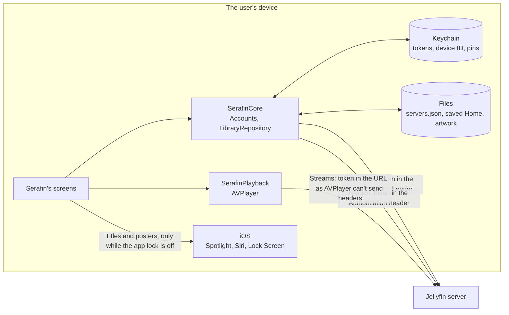

# Serafin security

How Serafin protects the people who use it: what's worth protecting, who might try to get at it, where the lines of trust run, and where each control lives in the code. Every statement here was checked against the code; the file and type names point to where.

To report a vulnerability, use GitHub's private vulnerability reporting on this repository (Security › Report a vulnerability) rather than a public issue.

## Scope

Serafin is a client for a Jellyfin server the user runs or has an account on. It talks only to the servers the user adds. It has no backend of its own, no analytics, ads or crash reporting, and collects nothing about the user.

Out of scope: the security of the Jellyfin server itself, of the user's network, and of iOS.

## Assets

| Asset | Where it lives | Why it matters |
| --- | --- | --- |
| Access tokens, one per server and user | Keychain | A token is a signed-in session on the user's server, with everything their account can see and do. |
| The device ID | Keychain | Identifies this install to servers, so the user can see and revoke it in the Jellyfin dashboard. |
| Certificate pins for self-signed servers | Keychain | Decide which certificate Serafin accepts for a host that no public authority vouches for. |
| Passwords | Memory only, while signing in | The key to the user's account, and often reused elsewhere. |
| The server list: addresses, names, user IDs and names | Application Support, `servers.json` | Says where the user's server is and who signs in to it. |
| The saved Home: titles, artwork references and progress | Caches, one file per account | Shows what the user watches. |
| Artwork | Caches, Nuke's disk cache, up to 200 MB | Shows what the user's library holds. |
| The library in Spotlight | The system's Spotlight index | Shows titles and posters outside the app. |
| Preferences: current account IDs, quality caps, subtitle size, accent colour | `UserDefaults` | Low value; holds no secrets or titles. |

## Actors

- **The user**, who owns the device and the server, or has an account on someone else's server.
- **Someone else holding the device**, briefly or after it's lost or stolen.
- **Someone on the same network**, who can see and sometimes change unencrypted traffic: a shared Wi-Fi, a hotel, a coffee shop.
- **A malicious or compromised server**, or anything pretending to be the user's server, which can send any response it likes.
- **Third-party code** in Serafin's dependencies.

## Trust boundaries

1. **The network**, between Serafin and every server. Nothing that crosses it is trusted.
2. **The server's responses.** Even the user's own server is treated as untrusted input: it may be compromised, misconfigured, or not the server the user meant.
3. **The device**, between Serafin's own storage and anyone who can unlock or take the device.
4. **The system**, where Serafin hands data to iOS: Spotlight, Siri and Shortcuts, the Lock Screen, AirPlay and Picture in Picture.

## Data flow

Every arrow to the server is HTTPS, or plain HTTP to a private address the user has accepted after a warning.

## Controls

The security requirements from `AGENTS.md`, and where each is met.

| Risk | Control | Where |
| --- | --- | --- |
| Password theft | Quick Connect is the default sign-in. A password is sent once to the server's sign-in endpoint and kept nowhere: the sign-in model clears it as it's sent, and only the returned token is saved. | `SignInModel`, `Accounts.signIn(to:username:password:)` |
| Token theft from the device | Tokens are Keychain items with `kSecAttrAccessibleAfterFirstUnlockThisDeviceOnly` and `kSecAttrSynchronizable` false, so they never reach iCloud Keychain or backups. One item per server and user, keyed `token.<server>.<user>`. Never in `UserDefaults`, files or logs. | `KeychainSecretStore`, `SessionStore`; tested in `AppTests/KeychainSecretStoreTests` |
| Token leak in transit | HTTPS by default. Plain HTTP only to private addresses (10/8, 172.16/12, 192.168/16, `.local`, localhost, Tailscale's 100.64/10), after a warning that can't be swiped away, and refused for public hosts before any request is sent. The only ATS key is `NSAllowsLocalNetworking`. | `TransportPolicy`, `PrivateNetwork`, `ConnectionSheets` (`interactiveDismissDisabled`), `App/Info.plist`; tested in `ServerAddressTests`, `ServerConnectorTests` |
| Self-signed certificates | No global ATS exception. A certificate the system doesn't trust is refused unless the user has checked its SHA-256 fingerprint and pinned it; then only that public key is accepted for that host. Pins are Keychain items keyed by host, and go when the last server using the host is removed. | `PinningDelegate`, `PinStore`, `CertificateFingerprint`; streams through `StreamLoader`; tested in `CertificatePinningTests` |
| Token in URLs | API calls and images carry the token in the `Authorization` header. Stream URLs carry it as a query parameter, since AVPlayer can't add headers to HLS segment requests, and they're never logged. The stream loader, which rewrites the master and subtitle playlists to put subtitles in time, fetches them through the pinning delegate, and its copies point only at the hosts the server's own playlists name. | `DeviceIdentity.authorizationHeader`, `Artwork`, `PlaybackNegotiator`, `StreamLoader`, `SubtitlePlaylists` |
| Token leak in logs | Every URL, name and title is logged with `privacy: .private`, tokens are never logged, and nothing logs a whole request or response. Messages are either errors or debug notes, and iOS doesn't keep debug notes unless a developer is streaming logs. | `Logger(serafinCategory:)` |
| Stale sessions | Sign-out deletes the token, then asks the server to end the session, waiting at most 10 seconds; the device is signed out either way. Removing a server signs out every user on it. Each install has one device ID, made once and kept in the Keychain, and the client name `Serafin` with the app version. | `Accounts.signOut(_:)`, `Accounts.remove(serverID:)`, `DeviceIdentity`; tested in `AccountsTests`, `AppTests/SignOutKeychainTests` |
| Third-party exfiltration | No analytics, ad or crash-reporting code. Dependencies are pinned to exact versions in `Packages/SerafinKit/Package.resolved`, and none makes requests of its own; see Dependencies below. | `Package.swift`, `Package.resolved` |
| Device shared or lost | An optional Face ID or passcode lock covers the app, the player and the app switcher, with a grace period. While it's on, Spotlight holds nothing from the library and Siri waits for the lock. Settings › Clear Cache deletes artwork and saved Homes. | `AppLock`, `LockLayer`, `SpotlightIndexer`, `Accounts.clearCaches()` |
| Malicious server | Responses are untrusted input. Decoding is bounded: public info at 64 KB, images at 20 MB, a saved Home at 8 MB, an HLS playlist the player's stream loader rewrites at 4 MB. Overviews are reduced to plain text, never rendered as HTML. Item IDs from outside the app, such as from Spotlight or a shortcut, must look like IDs Jellyfin issues before they're sent anywhere. Servers found on the network are accepted only at `http` and `https` addresses. | `ServerConnector.maximumInfoSize`, `ImagePipeline.responseLimit`, `HomeSnapshotStore.maximumFileSize`, `StreamLoader.playlistLimit`, `PlainText`, `ItemID.isPlain`, `LocalDiscovery.accept` |

## Dependencies

Swift packages only, pinned to exact versions in `Packages/SerafinKit/Package.resolved`, with no analytics, ads or crash reporting among them. Each was read for network code and hard-coded hosts; none has a host of its own.

| Package | Licence | Network behaviour |
| --- | --- | --- |
| Jellyfin SDK for Swift | MPL-2.0 | Requests go only to the server address it's given. Its local discovery broadcasts on UDP port 7359 on the local network, and only while Add Server is open. Its websocket and code generator aren't used. |
| Get | MIT | The SDK's `URLSession` wrapper. Makes no requests of its own. |
| Nuke | MIT | Loads only the image URLs Serafin asks for, through the pinning delegate. Makes no requests of its own. |
| SwiftNIO Transport Services, SwiftNIO | Apache-2.0 | Networking primitives the SDK's discovery runs on. No requests of their own. |
| Swift Atomics, Swift Collections, Swift System | Apache-2.0 | No network code. |

The Licences screen in Settings lists each package with its version and full licence, from `Licences.json`, which `scripts/licences.py` writes from `Package.resolved`. A test fails if the list and `Package.resolved` disagree.

## What Serafin keeps on the device

| What | Where | Protection | Removed by |
| --- | --- | --- | --- |
| Tokens, device ID, pins | Keychain | After first unlock, this device only, not synced or backed up | Sign-out and removing the server. iOS keeps Keychain items when an app is deleted, so they outlive a reinstall, though the server list that leads to a token doesn't |
| Server list | Application Support | Complete file protection: unreadable while the device is locked | Removing the server |
| Saved Home | Caches | Complete file protection; never backed up | Sign-out, removing the server, Clear Cache, iOS when space runs low |
| Artwork | Caches | iOS's default file protection; never backed up | Clear Cache, iOS when space runs low |
| Spotlight entries | Spotlight's index | Complete protection class | Turning on the lock, signing out, removing the server |
| Preferences | `UserDefaults` | iOS's default file protection | Removing the server (its quality caps), deleting the app |

## Known limits

- **Plain HTTP on a private network** sends the token, and a password if one is used, in the clear to anyone on that network. Serafin allows it only after a warning, because many home servers have no certificate. HTTPS, or a VPN such as Tailscale, avoids it.
- **Stream URLs carry the token.** A stream URL that leaked, for example from AirPlay to a shared receiver, would give its holder the session until the user signs out. That's a limit of AVPlayer, which can't send headers with HLS segment requests.
- **Artwork uses iOS's default file protection**, readable after the first unlock since restart, not the stricter class the server list and saved Home use.
- **Someone with the unlocked device** sees whatever the user can, unless the app lock is on.
- **A malicious server** can still show misleading titles and artwork, or refuse service. It can't run code in Serafin, open other apps through URLs, or make Serafin send the user's token to another host.
